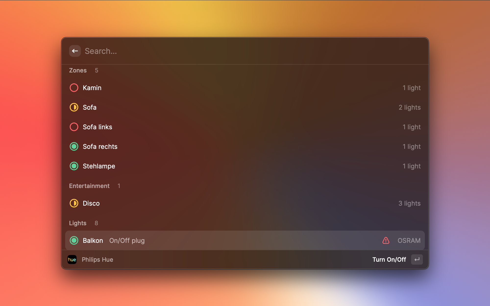

   
   <h1 align="center">Philips Hue</h1>
 

A [Raycast](https://raycast.com/) extension that lets you easily control [Philips Hue Smart Lightning Products](https://www.philips-hue.com/).

### Configure

Please provide **Hue bridge** and **API user** in the extension preferences (Preferences -> Extensions -> Philips Hue).\
To create a new API user follow the instructions on [Get Started](https://developers.meethue.com/develop/get-started-2/).

### Icon states

| Icon                                                   | Status                                                  |
| ------------------------------------------------------ | ------------------------------------------------------- |
|                        | Device is OFF                                           |
|  | Device is ON                                            |
|    | Room, Zone or Entertainment Area is partially turned ON |
|      | Device is not reachable                                 |

---

#### Has we forgotten something? Let us know and [create an issue](https://github.com/raycast/extensions/issues/new/choose)!
